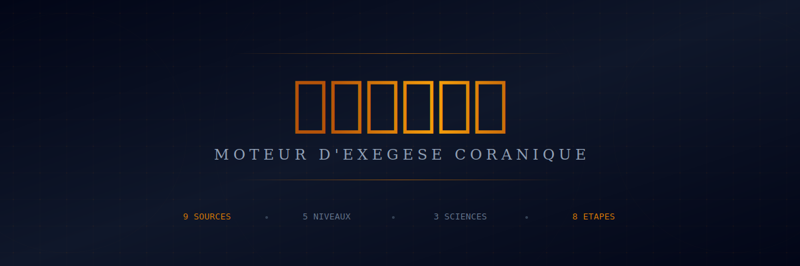
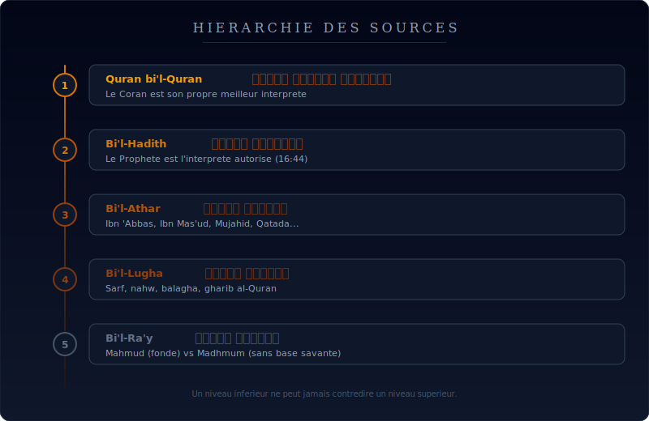
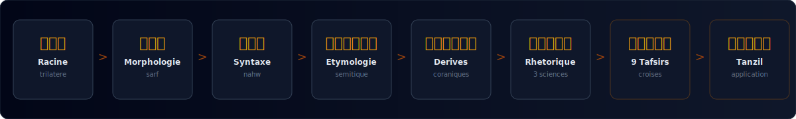

<div align="center">



<br/><br/>

[](https://github.com/YoussefJlidi/bayan)
[](https://github.com/YoussefJlidi/bayan)
[](https://github.com/YoussefJlidi/bayan)
[](https://github.com/YoussefJlidi/bayan)

**Un moteur de methodologie reproductible pour analyser le Coran avec rigueur academique.**

[Methodologie](#-hierarchie-des-sources) · [Sources](#-les-9-sources) · [Pipeline](#-pipeline-danalyse) · [Rhetorique](#-les-3-sciences-de-la-rhetorique) · [Certitude](#-echelle-de-certitude)

</div>

---

## Pourquoi Bayan

> **بَيَان** (bayan) : *clarte, eloquence, elucidation.* Le Coran dit : عَلَّمَهُ الْبَيَانَ — « Il lui enseigna le bayan » (55:4).

La plupart des outils de tafsir se limitent a une ou deux sources. **Bayan croise systematiquement 9 tafsirs**, combine l'analyse linguistique profonde (morphologie, etymologie semitique, rhetorique) et produit une synthese avec echelle de certitude.

Ce n'est pas un tafsir. C'est un **moteur de methodologie** — un systeme reproductible pour analyser n'importe quel mot ou verset coranique.

---

## 📐 Hierarchie des sources

<div align="center">

</div>

<br/>

<table>
<tr>
<td width="40" align="center"><strong>1</strong></td>
<td><strong>Quran bi'l-Quran</strong> — تفسير القرآن بالقرآن</td>
<td>Le Coran est son propre meilleur interprete. Un verset <em>mujmal</em> ici peut etre <em>mufassar</em> la-bas.</td>
</tr>
<tr>
<td align="center"><strong>2</strong></td>
<td><strong>Bi'l-Hadith</strong> — تفسير بالحديث</td>
<td>Le Prophete est l'interprete autorise (16:44). Explications, actes, approbations tacites.</td>
</tr>
<tr>
<td align="center"><strong>3</strong></td>
<td><strong>Bi'l-Athar</strong> — تفسير بالأثر</td>
<td>Ibn 'Abbas, Ibn Mas'ud, 'Ali, Mujahid, Qatada, al-Hasan al-Basri.</td>
</tr>
<tr>
<td align="center"><strong>4</strong></td>
<td><strong>Bi'l-Lugha</strong> — تفسير باللغة</td>
<td>Analyse linguistique : sarf, nahw, balagha, gharib al-Quran.</td>
</tr>
<tr>
<td align="center"><strong>5</strong></td>
<td><strong>Bi'l-Ra'y</strong> — تفسير بالرأي</td>
<td>Mahmud (fonde sur la maitrise) vs Madhmum (sans base savante).</td>
</tr>
</table>

> **Regle absolue** : un niveau inferieur ne peut jamais contredire un niveau superieur.

---

## 📚 Les 9 sources

Chaque analyse croise systematiquement ces 9 mufassirun :

###  Transmission

| # | Savant | Oeuvre | Periode | Approche |
|:-:|--------|--------|:-------:|----------|
| **1** | **al-Tabari** | *Jami' al-Bayan* | 839–923 | Rapporte **tout** puis tranche — encyclopedie du ma'thur |
| **2** | **Ibn Kathir** | *Tafsir al-Quran al-'Azim* | 1301–1373 | Quran par Quran → hadith → Compagnons specialises |

###  Droit

| # | Savant | Oeuvre | Periode | Approche |
|:-:|--------|--------|:-------:|----------|
| **3** | **al-Qurtubi** | *al-Jami' li-Ahkam* | 1214–1273 | Jusqu'a **40 jugements** extraits d'un seul verset |
| **6** | **al-Shawkani** | *Fath al-Qadir* | 1759–1839 | Condense et arbitre entre les ecoles |

###  Langue

| # | Savant | Oeuvre | Periode | Approche |
|:-:|--------|--------|:-------:|----------|
| **4** | **Ibn 'Atiyya** | *al-Muharrar al-Wajiz* | 1088–1147 | Analyse linguistique concise + avis personnels |
| **7** | **Ibn 'Ashur** | *al-Tahrir wa'l-Tanwir* | 1879–1973 | **30 tomes, 39 ans** — linguistique + maqasid, le chef-d'oeuvre du 20e siecle |

###  Purification

| # | Savant | Oeuvre | Periode | Approche |
|:-:|--------|--------|:-------:|----------|
| **5** | **Ibn al-Qayyim** | *al-Tafsir al-Qayyim* | 1292–1350 | Relation individuelle avec le texte, purification de l'ame |

###  Synthese

| # | Savant | Oeuvre | Periode | Approche |
|:-:|--------|--------|:-------:|----------|
| **8** | **al-Sabuni** | *Safwat al-Tafasir* | 1930–2021 | Distille l'avis le plus probable de l'ensemble |

###  Intra-coranique

| # | Savant | Oeuvre | Periode | Approche |
|:-:|--------|--------|:-------:|----------|
| **9** | **al-Shinqiti** | *Adwa' al-Bayan* | 1905–1973 | Chaque verset eclaire par d'autres versets + usul al-fiqh |

---

## ⚙️ Pipeline d'analyse

<div align="center">

</div>

<br/>

| Etape | Arabe | Description |
|:-----:|:-----:|-------------|
| **1. Racine** | جذر | Identifier les 3 lettres-racines. Sens nucleaire. Champ semantique complet. |
| **2. Morphologie** | صرف | Type, forme verbale (I-X), patron (*wazn*), cas grammatical, etat construit. |
| **3. Syntaxe** | نحو | Fonction, liens syntaxiques, ellipses (*hadhf*), antepositions (*taqdim*). |
| **4. Etymologie** | اشتقاق | Cognats hebreu, arameen, syriaque, akkadien. Evolution pre-islamique → coranique (Izutsu). |
| **5. Derives** | مشتقات | Tous les derives de la meme racine dans le Coran, avec references et frequence. |
| **6. Rhetorique** | بلاغة | 3 sciences : Ma'ani, Bayan, Badi' (voir ci-dessous). |
| **7. 9 Tafsirs** | تفسير | Consultation mot a mot des 9 sources. Confrontation. Selection de l'avis le plus solide. |
| **8. Tanzil** | تنزيل | Application au quotidien. Dimensions individuelle, intellectuelle, communautaire. |

---

## 🎭 Les 3 sciences de la rhetorique

La **balagha** arabe — systeme rhetorique sans equivalent occidental.

<table>
<tr>
<th width="33%">
<div align="center">

**علم المعاني**
'Ilm al-Ma'ani
*Semantique syntaxique*

</div>
</th>
<th width="33%">
<div align="center">

**علم البيان**
'Ilm al-Bayan
*Expression figurative*

</div>
</th>
<th width="33%">
<div align="center">

**علم البديع**
'Ilm al-Badi'
*Ornementation*

</div>
</th>
</tr>
<tr>
<td>

`Khabar/Insha'` `Taqdim/Ta'khir` `Qasr` `Fasl/Wasl` `Ijaz/Itnab` `Ta'rif/Tankir` `Dhikr/Hadhf`

</td>
<td>

`Tashbih` `Isti'ara` `Majaz mursal` `Majaz 'aqli` `Kinaya`

</td>
<td>

`Tibaq` `Jinas` `Saj'` `Iltifat` `Tawriya`

</td>
</tr>
</table>

---

## 📊 Echelle de certitude

Chaque affirmation est classee. **Toute affirmation sans classification est incomplete.**

```
 ████████████████████████████  Qat'i    قطعي    Definitif      Consensus + texte explicite
 ██████████████████████░░░░░░  Rajih    راجح    Preponderant   Majorite + preuves solides
 ██████████████░░░░░░░░░░░░░░  Muhtamal محتمل   Possible       Plusieurs avis valides
 ████████░░░░░░░░░░░░░░░░░░░░  Da'if    ضعيف   Faible         Minoritaire ou chaine faible
 ████░░░░░░░░░░░░░░░░░░░░░░░░  Zanni    ظني    Speculatif     Opinion sans consensus
```

---

## 🔄 Processus de consultation

```
9 tafsirs (lecture mot a mot)
  → regles linguistiques (nahw, sarf, balagha)
    → regles d'exegese (usul al-tafsir)
      → fondements juridiques (usul al-fiqh)
        → jurisprudence (fiqh)
          → tanzil (التنزيل) : lier le sens au quotidien
```

---

## 📖 Traductions croisees

Chaque verset est rendu par minimum **4 traductions complementaires** :

| Traducteur | Annee | Force |
|------------|:-----:|-------|
| **Hamidullah** | 1959 | Fidelite maximale, precision mot a mot |
| **Berque** | 1990 | Rythme, assonance, choix lexicaux audacieux |
| **Chebel** | 2009 | Registre moderne, comprehension immediate |
| **Asad** *(EN)* | 1980 | Rationaliste, 5000+ notes integrees |

> Aucune traduction ne remplace l'arabe. Chaque traduction est un angle de lecture.

---

## 🧬 Formes verbales (I–X)

| Forme | Wazn | Sens typique | Exemple |
|:-----:|------|-------------|---------|
| I | fa'ala | Sens de base | *rahima* — avoir pitie |
| II | fa''ala | Intensif / causatif | *'allama* — enseigner |
| III | fa'ala | Reciproque | *qatala* — combattre |
| IV | af'ala | Causatif | *aslama* — se soumettre |
| V | tafa''ala | Reflexif de II | *ta'allama* — apprendre |
| VI | tafa'ala | Reciproque de III | *taqatala* — s'entrecombattre |
| VII | infa'ala | Passif / reflexif | *inkasara* — se briser |
| VIII | ifta'ala | Reflexif / effort | *ijtahada* — s'efforcer |
| IX | if'alla | Couleurs / defauts | *ihmarra* — rougir |
| X | istaf'ala | Demande / consideration | *istaghfara* — demander pardon |

---

## 🔬 Approches academiques integrees

| Chercheur | Methode | Apport |
|-----------|---------|--------|
| **Izutsu** | Analyse semantique | Evolution du sens pre-islamique → coranique |
| **Neuwirth** | Analyse structurelle | Micro-structures, oralite liturgique |
| **Farahi / Islahi** | Theorie du *nazm* | Coherence interne, paires de sourates |
| **Fazlur Rahman** | Double mouvement | Sens originel → application contemporaine |

---

## 📏 7 principes

| # | Principe |
|:-:|----------|
| 01 | **Toujours citer les sources** — jamais d'affirmation sans attribution |
| 02 | **Distinguer consensus et divergence** — quand les savants divergent, le mentionner |
| 03 | **Respecter la hierarchie** — ne jamais contredire un niveau superieur par un inferieur |
| 04 | **Prudence sur l'i'jaz 'ilmi** — ne pas lier le Coran a des theories changeantes |
| 05 | **Multiplier les traductions** — une seule est toujours reductrice |
| 06 | **Contextualiser** — mecquois et medinois different en style, themes et destinataires |
| 07 | **L'arabe prime** — toute analyse part du texte arabe, jamais d'une traduction |

---

## 🏗️ Stack technique

```
bayan/
├── src/
│   ├── app/
│   │   ├── layout.tsx          # Layout global, fonts, meta
│   │   ├── page.tsx            # Homepage — methodologie
│   │   └── globals.css         # Tailwind + design tokens
│   └── ...
├── public/
│   ├── banner.svg              # Hero banner
│   ├── hierarchy.svg           # Schema hierarchie
│   └── pipeline.svg            # Schema pipeline
├── next.config.ts
└── package.json
```

- **Next.js 15** (App Router, static export)
- **TypeScript** strict
- **Tailwind CSS v4**
- Fonts : Amiri (arabe), Inter (corps), Playfair Display (titres)

---

<div align="center">

<br/>

**بَيَان** — *Parce que comprendre le Coran est une obligation, pas une option.*

<br/>


</div>
